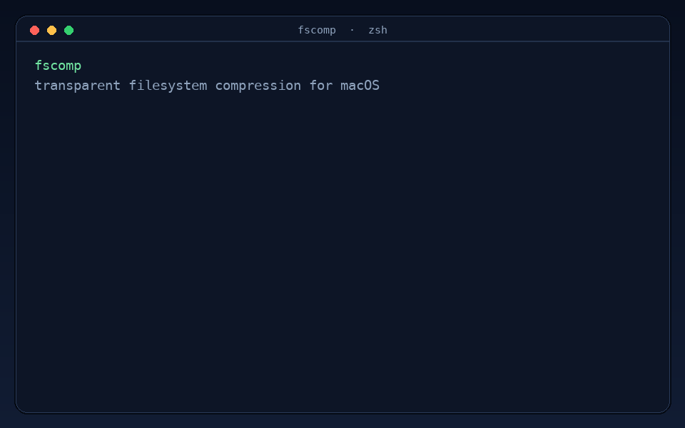

# Welcome to fscomp!

[](https://github.com/ltmerletti/fscomp/releases/tag/v1.0.0)  [](LICENSE)

```text
   __                                
  / _|___  ___ ___  _ __ ___  _ __   
 | |_/ __|/ __/ _ \| '_ ` _ \| '_ \ 
 |  _\__ \ (_| (_) | | | | | | |_) |
 |_| |___/\___\___/|_| |_| |_| .__/ 
                             |_|     
```

fscomp is a simple tool for transparent filesystem compression on macOS (with support for Linux filesystems planned for the future).



macOS supports transparent APFS compression natively. Files take up less disk space, but programs can still open and read them normally. Under the hood, `afsctool` handles the actual compression, but it does not keep an index, so it has to re-read every file whenever you run it. `fscomp` wraps it with a lightweight SQLite database to track file sizes, timestamps, and hashes so subsequent runs finish in seconds without re-doing work.

For example, here's what `fscomp status` looks like on my system:

```text
--- Database status ---
Tracked files:             413403
Compressed files:          407359
Incompressible files:      6044
Logical size:              191.89 GB
Physical size on disk:     120.39 GB
Space saved:               71.59 GB, 37.3%
-----------------------
```

Results depend on what kinds of files you have. Formats like zip, mp4, and png are already compressed, so fscomp skips them.

## Quick start

```bash
brew tap ltmerletti/fscomp https://github.com/ltmerletti/fscomp
brew install fscomp

# See what can be compressed without changing anything
fscomp scan ~/Documents

# Compress it and check the result
fscomp run ~/Documents
fscomp status
```

## What it does

- Uses the transparent compression built into APFS
- Leaves files where they are, so programs keep opening them normally
- Skips formats that are already compressed
- Remembers unchanged files, which makes later runs much faster
- Processes files in parallel and keeps track of the space actually saved
- Supports dry runs, quiet output, and detailed reports

## Installation and setup

### Homebrew (recommended)

This repo doubles as a Homebrew tap. Install with:

```bash
brew tap ltmerletti/fscomp https://github.com/ltmerletti/fscomp
brew install fscomp
```

### Prerequisites for a manual build

- macOS 11 or newer
- `afsctool` (install with `brew install afsctool`)
- Xcode command line tools (install with `xcode-select --install`)

### Build and install

To build and install fscomp, just run:

```bash
make
make install
```

This installs `fscomp` to `~/.local/bin` (just make sure that directory is in your `PATH`).

If you want to update and reinstall:

```bash
make upgrade
```

Or to run the test suites:

```bash
make test
make asan
```

## Usage

### Tracking folders

To track folders and update them together with one command, you can do the following:

```bash
# Add folders to track
fscomp add ~/Documents ~/Developer/logs

# Check what is tracked
fscomp list

# Compress all tracked folders
fscomp update

# Remove a folder from tracking
fscomp remove ~/Developer/logs
```

### Running one-off commands

If you want to run fscomp directly on a folder without adding it to the tracked list, you can do:

```bash
# Preview what would compress without writing to disk
fscomp scan ~/Documents

# Compress a directory directly
fscomp run ~/Documents
```

If you want to run it without verbose output or file notices:

```bash
# Print summary only without live progress or file notices
fscomp run -q ~/Documents

# Run silently with zero standard output
fscomp run -s ~/Documents
```

Set `worker_count` in `~/.config/fscomp/config.json` to process files in parallel:

```json
{
  "worker_count": 4
}
```

Use `--jobs <count>` to override that setting for one command.

And to check your space savings:

```bash
# View total space saved
fscomp status

# View savings breakdown by file extension
fscomp report
```

## How it works

### How files are skipped

- Skips formats that are already compressed (like zip, mp4, png, etc.)
- Checks file size and modification time against SQLite first, skipping the file with zero disk reads if neither changed
- Verifies SHA-256 before invoking `afsctool` if timestamps or sizes change
- Reads `st_blocks * 512` to track actual disk blocks saved

## Safety

`fscomp scan` is a dry run. It shows what is eligible for compression without writing to those files.

Compression is transparent, so file contents and paths do not change. If you interrupt a run, fscomp keeps the progress it already recorded in the database and can pick up the remaining work the next time you run it.

Do not run fscomp on `/`. The root macOS volume is sealed, read-only, and already compressed. Point it at source code repositories, document folders, logs, or build caches instead.
